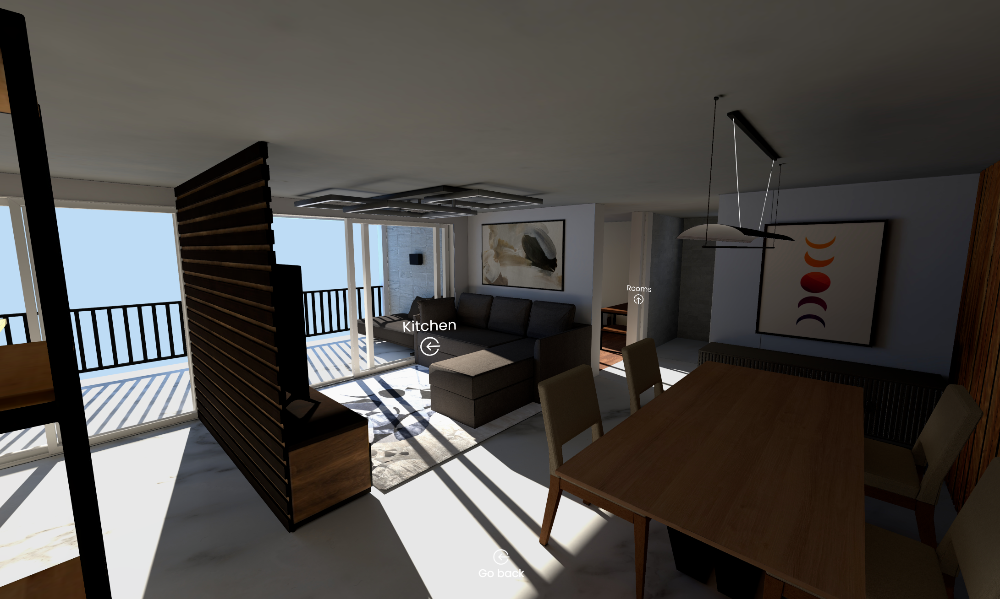

# Gleaming 

Gleaming is an interactive 3D apartment experience built with Next.js, React Three Fiber, and Three.js. 

The project allows users to explore an apartment and move between the living room, kitchen, bedrooms, and bathroom through smooth, animated camera transitions.
